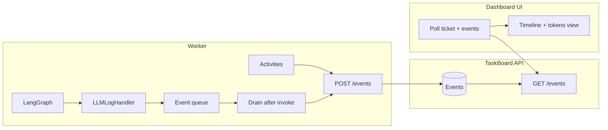

# Live dashboard for workflow and LLM tokens

## Current state

- **LLM I/O:** [worker/langgraph_runner.py](worker/langgraph_runner.py) — `LLMLogHandler` writes full prompts and responses to `logs/llm/*.md` only; no push to any API.
- **Workflow progress:** Worker calls TaskBoard `post_update` (ticket updates) and `patch_run` (phase, branch, etc.). No granular “activity started/finished” or “LLM call” events.
- **TaskBoard API:** [POST /events](docs/API.md) and [GET /events](docs/API.md) exist (`ticket_id`, `type`, `since`, `limit`). Ticket DTO includes `run` (phase, branch, etc.). No SSE or WebSocket.

## Architecture

## 1. Worker: emit events to TaskBoard

**1.1 Event queue and ticket_id in run_task**

- In [worker/langgraph_runner.py](worker/langgraph_runner.py), `run_task` receives `thread_id` (e.g. `ticket-T93`). Parse ticket_id from it (e.g. strip `ticket-` prefix).
- Create a thread-safe queue (e.g. `queue.Queue`) and pass it into the graph so the handler can push to it. Because LangGraph nodes may not receive `config` reliably, use a **context variable** (e.g. `contextvars.ContextVar`) set in `run_task` before `graph.invoke`: store `(ticket_id, queue)`. Handler reads from the context var and pushes event dicts.

**1.2 LLMLogHandler: push to queue**

- Add an optional “sink”: in `_run_config_with_llm_log`, create the handler with the queue from context (if set).
- In `on_llm_start`: push `{ "type": "llm.start", "step": step, "at": ts, "tokens_in_preview": prompts[0][:2000] if prompts else "" }` (truncate to avoid huge payloads).
- In `on_llm_end`: build a short summary (content snippet, tool_calls names); push `{ "type": "llm.end", "step": step, "at": ts, "tokens_out_preview": content[:2000], "tool_calls": [tc.get("name") for tc in ...] }`.
- Keep existing file logging as-is.

**1.3 Drain queue and POST to TaskBoard**

- After `graph.invoke` in `run_task`, drain the queue and for each item call `post_event(type=item["type"], ticket_id=ticket_id, payload=item)`. Use the existing [worker/taskboard_client.py](worker/taskboard_client.py) `post_event`. Run in a sync way (e.g. `asyncio.run()` one-off or pass an async post_event runner). Note: `run_task` is sync and `post_event` is async — options: (a) run_task is called from an async activity, so we could pass an async post_event in and the activity does the drain + await; or (b) use a thread or sync HTTP in the worker to POST events. Prefer (a): have `execute_task_with_lang_graph` pass a small helper that the runner can call to “flush events” (queue + ticket_id returned from run_task), and the activity drains and calls `post_event` after `run_task` returns.

Simpler approach: **run_task returns the event list** instead of pushing from inside the graph. So: in run_task, use a list (not queue) that the handler appends to (handler gets list ref from context var). After invoke, run_task returns (task_result, success, decision_id, **events**). Activity then calls post_event for each. So no async in run_task; handler only appends to a list; activity does the POST. That works.

**1.4 Activities: emit activity.started / activity.completed**

- In [worker/activities.py](worker/activities.py), at the start of `execute_task_with_lang_graph` call `post_event("activity.started", ticket_id, { "activity": "execute_task_with_lang_graph" })`; at the end (success or exception path) call `post_event("activity.completed", ticket_id, { "activity": "execute_task_with_lang_graph", "success": bool })`. Optionally do the same for `prepare_workspace`, `run_task_tests`, `close_task` so the dashboard shows a full timeline. Ensure `patch_run(phase=...)` is called so run phase matches (e.g. Implement during Execute, Test during run_tests).

**1.5 run_task return value and activity**

- Extend `run_task` to accept an optional list (or create one) and pass it via context so the handler appends to it. Return that list from run_task. In `execute_task_with_lang_graph`, after run_task returns, iterate the list and `await post_event(e["type"], ticket_id, e["payload"])` for each.

## 2. API

- **No change required for minimal version:** Dashboard polls `GET /events?ticket_id=<id>&since=<last_created_at>&limit=100` and `GET /tickets/<id>` (for `run.phase`). Use `created_at` of the last event for the next `since` (or use event `id` if the API supports cursor; currently it uses `since` as datetime).
- **Optional later:** Add `GET /events/stream?ticket_id=...` returning Server-Sent Events for true push; API would poll DB or use a notification mechanism and write SSE. Defer to a follow-up unless you want it in scope.

## 3. Dashboard UI

**3.1 Location and routing**

- Add a new route in [TaskBoard.Ui](TaskBoard.Ui/), e.g. `/run/:ticketId` or `/dashboard` (with ticket selector). Reuse existing auth and API base URL.

**3.2 Data**

- Poll `GET /tickets/:id` every 2s (for `run.phase`, run summary).
- Poll `GET /events?ticket_id=:id&since=:iso&limit=200` every 2s; pass `since` as the oldest `created_at` from the previous batch (or on first load omit `since` to get latest 200, then use oldest for next poll). Append new events to a list and sort by `created_at` for display (API returns newest first, so reverse for chronological order).

**3.3 Layout**

- **Header:** Ticket id, title, run phase (Plan / Implement / Test / Review / etc.), last updated.
- **Timeline:** List of events in chronological order. Each event shows: time, type (activity.started, activity.completed, llm.start, llm.end), and for llm events expandable section showing “Tokens in (preview)” and “Tokens out (preview)” and tool_calls if any. Use a simple card or accordion per event.
- **Optional:** “Open full log” link to the latest `logs/llm/*.md` file if you expose it (e.g. via TaskBoard attachment or a small static endpoint). Otherwise the preview in the dashboard is enough for “live” feel.

**3.4 Tech**

- Use existing TaskBoard.UI stack (React, existing API client). Add a new page component and route; use `setInterval` or React Query with a short refetch interval for polling.

## 4. File and type summary

| Area                       | File(s)                                                  | Change                                                                                                                                                              |
| -------------------------- | -------------------------------------------------------- | ------------------------------------------------------------------------------------------------------------------------------------------------------------------- |
| Worker – context + handler | [worker/langgraph_runner.py](worker/langgraph_runner.py) | Context var for (ticket_id, event_list); LLMLogHandler appends llm.start / llm.end to list; run_task returns event list                                             |
| Worker – activity          | [worker/activities.py](worker/activities.py)             | execute_task_with_lang_graph (and optionally others) post activity.started / activity.completed; drain run_task events and post_event each; ensure phase is patched |
| API                        | TaskBoard.Api                                            | None for minimal (optional: SSE endpoint later)                                                                                                                     |
| UI                         | TaskBoard.Ui (new page + route)                          | New route e.g. /run/:ticketId; poll ticket + events; timeline + expandable token previews                                                                           |

## 5. Out of scope / follow-ups

- **Token-by-token streaming:** Would require LLM streaming and `on_llm_new_token`; not in this plan.
- **SSE from API:** Can be added later for true push; polling every 2s is sufficient for “live” feel.
- **Exposing full log files:** Could attach the latest .md as a ticket attachment at end of run, or serve from a small static server; optional.

