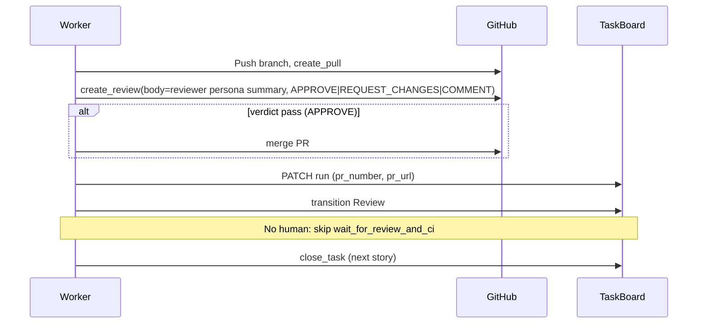

# Worker PR submission and GitHub review

## Current state

- **PR creation:** [worker/activities.py](worker/activities.py) already has `open_or_update_pr`: it pushes the branch and calls `repo.create_pull(...)` when `GITHUB_TOKEN` and a valid repo slug are set. No reviewers are requested.
- **Wait for review:** `wait_for_review_and_ci` polls the PR (every 60s, up to 120 iterations) and checks `pr.get_reviews()` for `CHANGES_REQUESTED` / `REQUEST_CHANGES` and merge/close state. When `pr_number <= 0` or token/repo missing, it returns `"merged"` immediately (no blocking).
- **Flow:** Workflow already transitions to Review after opening the PR and, on `changes_requested`, re-runs Execute → Tests → Open PR again.
- **Tracking:** TaskBoard run has `pr_number` (PATCH and RunDto); the UI can show a PR link if it has the repo (e.g. from ticket or run). There is no `pr_url` on the run today; link can be built as `https://github.com/{repo}/pull/{pr_number}`.

So PR submission **already works** when you set `GITHUB_TOKEN` and `WORKSPACE_REPO=owner/repo` (or ticket `repo`). What we're adding:

**Primary: Gitea.** Use Gitea (e.g. in Docker) as the main Git host for development and E2E testing: no GitHub account, simple user+token auth, full flow (clone, push, PR, review, merge) testable locally. GitHub is supported as an alternative when you need it.

1. **Review from the reviewer persona:** Post the LangGraph Reviewer verdict as a PR review (on Gitea or GitHub) so the review is visible and trackable.
2. **PR link in TaskBoard and UI:** Store `pr_url` and show a one-click "Open PR" link.
3. **No human intervention until stories are done:** No human reviewers; do not wait for a human to merge. After opening the PR and posting the reviewer-persona review, close the task and move to the next story (PRs stay open for batch merge later).
4. **Test, iterate, and fix before done:** Completely test the workflow end-to-end; iterate on any issues; fix whatever is necessary before considering development complete.
5. **Worker creates repo if missing:** If the target repo does not exist, the worker creates it (via GitHub or Gitea API) before cloning or pushing, so no manual repo creation is required.
6. **Worker merges the PR when reviewer persona approves:** After posting the review, if the verdict was **pass** (APPROVE), the worker merges the PR via the host API so the branch is merged without human action.
7. **Auto-create Gitea creds and run automated E2E before done:** A bootstrap script creates the Gitea API token and test repo via the Gitea API and writes `GITEA_URL`, `GITEA_TOKEN`, `WORKSPACE_REPO` to `.env.e2e` so they are set automatically; no manual UI steps. Development is not complete until the full E2E run (Gitea → bootstrap → workflow → verify) passes.

---

## 1. Review from the reviewer persona: post LangGraph Reviewer verdict and merge when approved

**Goal:** The review in GitHub/Gitea comes from the reviewer persona (LangGraph Reviewer node). Post its verdict as an official PR review; when the verdict is **pass**, the worker merges the PR so no human merge is required.

**Implementation:**

- **Capture verdict and summary in task_result:** In [worker/langgraph_runner.py](worker/langgraph_runner.py), the Reviewer node sets `reviewer_verdict` (pass/fail/risky) and the final state is in `result`. Extend the Reviewer node to also return a short **review summary** (e.g. in state `reviewer_summary`) and write both into `task_result.json`: keep existing `pass`, `files_changed`; add `"review_summary": "..."` and optionally `"reviewer_verdict": "pass"|"fail"|"risky"`.
- **Post review after PR creation:** In `open_or_update_pr` in [worker/activities.py](worker/activities.py), after creating the PR:
  - Read `task_result.json` from the workspace (already read for PR body).
  - If a review summary or verdict is present and the Git host token is set, call the host's "create a review" API (GitHub: `pr.create_review(...)`; Gitea: equivalent). Map verdict: **pass** → `event="APPROVE"`; **fail** → `event="REQUEST_CHANGES"`; **risky** → `event="COMMENT"`.
  - The token's user will appear as the reviewer.
- **Merge when approved:** If the verdict was **pass** (and we posted APPROVE), call the host's merge API (GitHub: `pr.merge()` or `pr.merge(merge_method="merge"|"squash"|"rebase"`; Gitea: equivalent merge endpoint). Use optional env e.g. `GITHUB_MERGE_METHOD=squash` (default merge or squash). On success, the PR is merged and the branch is updated on the host. If merge fails (e.g. branch protection, conflicts), log and do not block close_task — the run still gets pr_number/pr_url and the ticket can be closed; the user can merge or fix later. Document that the token needs **merge** permission (ability to merge PRs into the base branch).

---

## 2. PR link in TaskBoard and UI

**Goal:** Track code changes and open the PR from TaskBoard with a one-click link.

- **API:** Add optional `pr_url` to the run entity, PATCH contract, and RunDto in TaskBoard.Api. Migration for new column.
- **Worker:** When `open_or_update_pr` succeeds, PATCH run with `pr_url=pr.html_url`.
- **UI:** On the ticket/run view, show an "Open PR" link when `pr_number` or `pr_url` is present: use `run.pr_url` if set, otherwise build `https://github.com/{repo}/pull/{pr_number}` from ticket/repo + run.pr_number (ensure ticket or run exposes repo where the UI can read it).

---

## 3. No human intervention until stories are done

**Goal:** No human reviewers and no waiting for human merge. The worker opens PRs, posts the reviewer-persona review, **merges the PR when the reviewer persona approved** (pass), then closes the task and picks the next story.

**Implementation:**

- **Config:** Use existing `SKIP_PR` or add a dedicated flag (e.g. `SKIP_PR_WAIT=1` or interpret `SKIP_PR` as "skip PR wait") so that when set, the workflow **does not** call `wait_for_review_and_ci` after `open_or_update_pr`. Flow becomes: Execute → Tests → Open PR (push, create_pull, post reviewer-persona review, **merge PR when verdict was pass**, PATCH pr_url) → Close task → next story.
- **Workflow:** In [worker/workflow.py](worker/workflow.py), when this mode is on (e.g. `skip_pr` True or new flag), after `open_or_update_pr` do not enter the `wait_for_review_and_ci` loop; set `merged = True` and go to close_task. No polling for human merge or human review.
- **Risky / human approval in LangGraph:** Today "risky" triggers an interrupt and TaskBoard approval. For "no human until stories are done", either (a) auto-approve risky (e.g. when skip_pr or the new flag is set, treat risky as pass and continue), or (b) leave risky as blocking for that task only. Plan recommends (a): when no-human mode is on, if the graph returns needs_approval (risky), auto-approve and continue so the worker never blocks on human.

**Out of scope for this phase:** Requesting human reviewers, waiting for human merge, or human approval of "risky" until you explicitly enable that later.

---

## 3b. Worker creates the repo if it doesn't exist

**Goal:** If the target repo (from `WORKSPACE_REPO` or ticket `repo`) does not exist on the Git host, the worker creates it before cloning or pushing, so the flow does not require manual repo creation.

**Implementation:**

- **Ensure repo before clone/push:** In [worker/activities.py](worker/activities.py), in `prepare_workspace` (and, when using `WORKSPACE_PATH`, before the first push in `open_or_update_pr`), resolve the effective repo slug (`owner/name`). Call the host's "get repo" API (GitHub: `gh.get_repo(repo_slug)`; Gitea: GET repo). If the repo is missing (404 or equivalent), call the host's "create repository" API:
  - **GitHub:** `user.create_repo(name, private=..., description=...)` when owner is the token's user, or `org.create_repo(name, ...)` when owner is an org (token needs org repo creation permission). Use optional env e.g. `GITHUB_REPO_PRIVATE=true` (default true for safety) and optional `GITHUB_REPO_DESCRIPTION`.
  - **Gitea:** Equivalent create-repo API (e.g. POST `/repos` or Gitea client). Same idea: create under user or org with optional private/description.
- **Then proceed:** After ensuring the repo exists, continue with clone (in prepare_workspace) or push (in open_or_update_pr). If create fails (e.g. permission), surface a clear error and do not retry indefinitely.
- **Token scope:** Document that for "create repo" the GitHub token needs full `repo` scope (or create_repo); for an org, the token must be allowed to create repos in that org. Gitea token needs repo creation permission. If the user does not want auto-create, they can pre-create the repo and the worker will skip create (repo already exists).

---

## 4. Test the workflow end-to-end, iterate, and fix before ending development

**Goal:** Do not consider development complete until the full workflow has been tested, issues have been iterated on, and necessary fixes are in place.

**Test setup (prerequisites) – Gitea first, GitHub optional:**

E2E testing needs a Git host that supports clone, push, create pull request, create review, and merge. **Primary path: Gitea** (recommended for dev and E2E). GitHub is optional.

**Option A – Gitea (primary; recommended for E2E and avoiding GitHub auth):**

- **Run Gitea:** Add Gitea to docker-compose (or run the official image) with initial admin user set via env (Gitea supports this for Docker). No GitHub account or token required.
- **Worker:** When `GITEA_URL` and `GITEA_TOKEN` are set, the worker uses Gitea for clone, push, create PR, create review, and merge. Full E2E is testable locally without external services.
- **Auto-create Gitea creds and set them:** A **bootstrap script** (e.g. `scripts/gitea_bootstrap.sh` or `scripts/e2e-setup-gitea.py`) runs as part of E2E setup. It: (1) waits for Gitea to be ready (HTTP health check), (2) uses the initial admin user (from env, e.g. `GITEA_ADMIN_USER`, `GITEA_ADMIN_PASSWORD` set in docker-compose or .env) to call Gitea's API (Basic Auth) to create an API token (POST `/api/v1/users/{username}/tokens`), (3) creates the test repo via API if needed, (4) writes `GITEA_URL`, `GITEA_TOKEN`, `WORKSPACE_REPO` to a file (e.g. `.env.e2e` or `worker/.env.e2e`) or exports them so the worker and test runner use them without manual setup. No manual "create token in Gitea UI" step; creds are created and set automatically before the test runs.
- **E2E:** Start Gitea → run bootstrap script (creates token and repo, writes env) → source generated env → run the E2E procedure. Document this as the default test setup in the README and runbook.

**Option B – GitHub (alternative):**

- **GitHub repo and token:** Set `GITHUB_TOKEN`, `WORKSPACE_REPO` (or ticket repo). Token needs Contents, Pull requests (read/write), and merge. Document as optional for users who want to target GitHub.
- **No secrets in the plan:** You set env vars locally (or in CI). README documents both Gitea (primary) and GitHub (optional).

**Gitea in a container (detailed)**

Gitea is a self-hosted, GitHub-like server. It provides Git over HTTP (clone/push), pull requests, PR reviews, and merge via its REST API.

- **Run Gitea:** Add a `gitea` service to `docker-compose.yml` (or a separate compose file for E2E), or run the official Gitea image (e.g. `docker run -p 3000:3000 gitea/gitea`). Persist data with a volume so the test repo and token survive restarts. Expose Gitea on a fixed host/port (e.g. `http://localhost:3000`).
- **Worker support for Gitea (primary path):** Implement Gitea as the default/primary Git host in the worker:
  - When `GITEA_URL` and `GITEA_TOKEN` are set, use Gitea for: clone URL (Gitea HTTP), push, create repo if missing, create pull request, create review, and merge via Gitea's REST API. Use a Gitea client or thin wrapper (Gitea API paths differ from GitHub's).
  - When Gitea is not set, use PyGithub and `GITHUB_TOKEN` (GitHub as alternative). Env-check script: if GITEA_URL is set, require GITEA_TOKEN and Gitea reachable; else require GITHUB_TOKEN.
- **E2E with Gitea:** Default flow uses the **bootstrap script** so no manual UI steps. README and runbook present this as the primary way to run and test the worker.

**Auto-create Gitea creds and set them (bootstrap):**

- **Bootstrap script** (e.g. `scripts/gitea_bootstrap.sh` or `scripts/e2e-setup-gitea.py`): Run after Gitea is up. (1) Wait for Gitea to be ready (curl health or `/api/v1/version`). (2) Use admin creds from env (`GITEA_ADMIN_USER`, `GITEA_ADMIN_PASSWORD` — set in docker-compose for the Gitea container so the initial admin exists) with Basic Auth to call `POST /api/v1/users/{username}/tokens` to create an API token with repo scope. (3) Create the test repo via API (`POST /api/v1/user/repos` or org repos) if it does not exist. (4) Write `GITEA_URL`, `GITEA_TOKEN`, `WORKSPACE_REPO` to `.env.e2e` (or equivalent) so the worker and E2E runner can `source` or load them. Optionally print the vars for CI. The worker then runs with these env vars set; no manual creation of token or repo in the Gitea UI.
- **Docker-compose:** Set Gitea env for initial admin (e.g. `GITEA__admin__USER`, `GITEA__admin__PASSWORD` per Gitea docs) so the bootstrap script can use them. Keep these in a local `.env` or compose env file only (not committed).

**Incorporating repo and creds into the test run:**

- **E2E env-check script:** Add a script (e.g. `worker/scripts/check_e2e_env.py` or `scripts/check-e2e-env.sh`) that the test procedure runs after bootstrap (or first when not using bootstrap). It checks: **either** `GITEA_URL` + `GITEA_TOKEN` **or** `GITHUB_TOKEN`; `WORKSPACE_REPO` or `WORKSPACE_PATH`; `TASKBOARD_URL` and `TASKBOARD_TOKEN`; LLM config. If anything is missing or invalid, print what to set. Exit non-zero so the test run fails fast.
- **Test procedure (runbook) – automated before ending development:** Document and follow a fixed sequence. **Default: Gitea with bootstrap.**  
  1. **Setup:** Start Gitea (e.g. `docker compose up -d gitea`). Run the **bootstrap script** so Gitea creds and repo are created and written to `.env.e2e`. Source `.env.e2e` (or export). Run the env-check script; fix any failures.
  2. **Start stack:** Start Temporal, TaskBoard API, worker (with `SKIP_PR` or skip-PR-wait; worker loads `GITEA_URL`, `GITEA_TOKEN`, `WORKSPACE_REPO` from env). **Seed the two E2E stories** (scaffold task API + CRUD endpoints, Story 2 blocked by Story 1) via the E2E seed script so both tickets point at the test repo.
  3. **Run workflow:** Start the DarkFactoryRun workflow. Let it run Execute → Tests → Open PR → post reviewer-persona review → merge → close task.
  4. **Verify:** Branch pushed, PR exists on Gitea, PR has the reviewer-persona review, PR was merged, run has `pr_number`/`pr_url`, ticket is Done, UI shows "Open PR" link. After both stories complete: Story 1 (scaffold) and Story 2 (CRUD) are both Done; the repo contains the scaffolded API and then the CRUD endpoints. If any step fails, fix and re-run from the appropriate step.
- **Iterate:** If tests fail or behavior is wrong, fix the code and re-run the procedure until it passes.
- **Definition of done:** Development is complete **only when this automated E2E run passes** (Gitea started → bootstrap creates and sets creds → full workflow runs → verify). No manual Gitea UI steps. The bootstrap script, env-check, and runbook are documented so anyone can reproduce the test; the implementation must run the automated E2E and fix issues before development is considered complete.

**E2E test stories: two dependent stories (task API)**

Use two stories that build on one another so the worker runs Story 1 first, then Story 2 (Story 2 is blocked by Story 1). Both target the same repo (the Gitea repo from bootstrap; use `WORKSPACE_REPO` when seeding). The stories are detailed enough for a simpler LLM worker: clear scope, concrete acceptance criteria, and test plans. Suggested tech: **Python 3.11+ with FastAPI** (minimal boilerplate, single `main.py` or small module layout).

**Story 1 – Scaffold a basic API to store tasks**

- **Title:** Scaffold a basic API to store tasks (Python FastAPI)
- **Repo:** Same as `WORKSPACE_REPO` from bootstrap (e.g. `e2e/task-api`).
- **Description:** Create a new Python project that will become a small REST API for storing tasks. Use FastAPI and Python 3.11+. Create a project root with: a `requirements.txt` containing `fastapi` and `uvicorn`; a single application file (e.g. `main.py`) that creates a FastAPI app and defines one GET endpoint at the root path `/` that returns JSON `{"service": "task-api", "status": "ok"}`. Add an in-memory list (e.g. a global or module-level list) that will later hold tasks; do not expose it yet. The app must run with `uvicorn main:app --reload` (or `python -m uvicorn main:app`) and respond with 200 at `GET /`. No database or persistence yet; the next story will add CRUD endpoints for tasks and task lists. Include a short README with setup (e.g. `pip install -r requirements.txt`, `uvicorn main:app`).
- **Acceptance criteria:**
  - Project has `requirements.txt` with `fastapi` and `uvicorn`.
  - Single entry file (e.g. `main.py`) with a FastAPI app and `GET /` returning `{"service": "task-api", "status": "ok"}`.
  - An in-memory structure (e.g. list or dict) exists in code for future tasks/lists; no endpoints use it yet.
  - `uvicorn main:app` starts the server and `GET /` returns 200 and the expected JSON.
  - README describes how to install dependencies and run the API.
- **Test plan:** Run `pip install -r requirements.txt` and `uvicorn main:app`; curl `GET /` and confirm 200 and JSON. Optionally run `pytest` if a minimal test file is added.
- **Dependencies:** None (this is the first story).

**Story 2 – Add CRUD endpoints for tasks and task lists**

- **Title:** Add CRUD endpoints for tasks and task lists (Python FastAPI)
- **Repo:** Same as `WORKSPACE_REPO` (same repo as Story 1).
- **Description:** Add REST endpoints to the existing task API so clients can create, read, update, and delete **tasks** and **task lists**. Data is stored in memory (no database). A **task list** has: `id` (string, UUID), `name` (string). A **task** has: `id` (string, UUID), `title` (string), `completed` (boolean), `list_id` (string, optional; references a task list id). Implement: (1) Task lists: `POST /lists` (body: `{"name": "..."}`) create and return the list; `GET /lists` return all lists; `GET /lists/{id}` return one list or 404; `PATCH /lists/{id}` (body: `{"name": "..."}`) update name; `DELETE /lists/{id}` remove list and its tasks. (2) Tasks: `POST /tasks` (body: `{"title": "...", "list_id": "..."}` optional) create and return the task; `GET /tasks` (query: optional `list_id`) return all tasks or filter by list; `GET /tasks/{id}` return one task or 404; `PATCH /tasks/{id}` (body: `{"title": "...", "completed": ...}`) update; `DELETE /tasks/{id}` remove task. Use 201 for create, 200 for read/update, 204 for delete, 404 for not found. Generate UUIDs for new ids (e.g. `uuid.uuid4()`).
- **Acceptance criteria:**
  - Task list model has `id`, `name`; task model has `id`, `title`, `completed`, `list_id`.
  - `POST /lists` and `GET /lists`, `GET /lists/{id}`, `PATCH /lists/{id}`, `DELETE /lists/{id}` implemented and return correct status codes and JSON.
  - `POST /tasks`, `GET /tasks` (with optional `list_id`), `GET /tasks/{id}`, `PATCH /tasks/{id}`, `DELETE /tasks/{id}` implemented and return correct status codes and JSON.
  - Deleting a list removes or orphans its tasks (define one behavior and stick to it).
  - All ids are UUIDs; 404 returned when resource is not found.
- **Test plan:** Start the API; use curl or a small script to create a list, create tasks (with and without list_id), get list and tasks, update and delete; verify status codes and response shapes. Optionally add pytest tests for the endpoints.
- **Dependencies:** Story 2 is **blocked by** Story 1 (so the worker picks Story 1 first; after Story 1 is Done, pick-next returns Story 2).

**Seeding the E2E stories**

- Add or extend an E2E seed script (e.g. `scripts/seed-e2e-stories.sh` or a step in the bootstrap/runbook) that: (1) Reads `WORKSPACE_REPO` from `.env.e2e` (or env). (2) POSTs the two tickets above to the TaskBoard API, using that repo for both. (3) Fetches the created ticket IDs (e.g. from list response sorted by id). (4) Calls `PUT /tickets/{id2}/deps` with body `{"blocked_by": ["<id1>"]}` so Story 2 is blocked by Story 1. Use the same API base URL and token as the rest of E2E (e.g. TaskBoard URL and dev-token). The runbook then starts the workflow; the worker picks Story 1, completes it (scaffold API, PR, merge), then picks Story 2 (CRUD endpoints, PR, merge).

---

## 5. Ensuring PRs are created (config and docs)

- **Repo format:** Tickets (or workflow input) must supply repo as `owner/repo`. If you use a single repo for all tasks, set `WORKSPACE_REPO=owner/repo` so clone and PR target are correct.
- **Token scope:** The token must have: **Contents** (read/write for push), **Pull requests** (read, write, and **merge**). For GitHub fine-grained tokens: repo scope plus Pull requests (include "Merge pull requests"). The worker merges the PR when the reviewer persona approved (pass), so merge permission is required. Same for Gitea token.
- **Docs:** Add a short "GitHub PR and review" section to [worker/README.md](worker/README.md): set `GITHUB_TOKEN` (with merge permission), `WORKSPACE_REPO` (or ticket repo); after Execute and Tests the worker opens a PR, posts the reviewer-persona review, merges the PR when approved, and closes the task so all stories can complete without human intervention.

---

## 6. Flow summary

(When using Gitea, replace "GitHub" in the diagram with "Gitea"; the flow is the same.)

---

## 7. Optional: Pass GitHub review feedback into re-execution

Today when `wait_for_review_and_ci` returns `changes_requested`, the workflow re-runs Execute without passing the review body. To have the Implementer "re-address review" using the reviewer's comments:

- In `wait_for_review_and_ci`, when you detect CHANGES_REQUESTED, also collect the latest review body (and optionally review comments) and return them (e.g. in a dict `{ "outcome": "changes_requested", "review_body": "...", "review_comments": [...] }`).
- Workflow passes that into the next `execute_task_with_lang_graph` (e.g. as an extra argument or via a small file in the workspace that the activity writes before calling the runner).
- LangGraph state already has `reviewer_feedback`; the runner can seed it from the GitHub review body so the Implementer prompt includes "Human reviewer requested: …". This is a follow-up enhancement once the base PR + reviewer-persona review flow is in place.

---

## File and change summary

| Area        | File(s)                                                                  | Change                                                                                                                                 |
| ----------- | ------------------------------------------------------------------------ | -------------------------------------------------------------------------------------------------------------------------------------- |
| LangGraph   | [worker/langgraph_runner.py](worker/langgraph_runner.py)                 | Add `reviewer_summary` to state; write `review_summary` and `reviewer_verdict` into `task_result.json`.                                |
| Activities  | [worker/activities.py](worker/activities.py)                             | Ensure repo exists before clone/push (create if 404). In `open_or_update_pr`: post reviewer-persona review; **merge PR when verdict pass** (GitHub/Gitea merge API); PATCH `pr_url`. Support GitHub and Gitea. No human reviewers. Token needs merge permission. |
| API         | TaskBoard.Api Run entity + PATCH + DTOs + migration                      | Add `pr_url`; worker PATCHes it when PR is created.                                                                                     |
| UI          | TaskBoard.Ui ticket/run view                                             | Show "Open PR" link from `pr_url` or build from repo + `pr_number`.                                                                     |
| Workflow    | [worker/workflow.py](worker/workflow.py)                                 | When skip-PR-wait (e.g. SKIP_PR): after open_or_update_pr, skip wait_for_review_and_ci and close task; optional auto-approve risky.   |
| Docs        | [worker/README.md](worker/README.md), [docs/DEPLOY-DOCKER.md](docs/DEPLOY-DOCKER.md), [docs/E2E-TEST-DARK-FACTORY.md](docs/E2E-TEST-DARK-FACTORY.md) | Document Gitea-first setup and E2E runbook; reviewer-persona review and merge; GitHub optional.                                        |
| Testing     | `worker/scripts/check_e2e_env.py` (or equivalent)                                                                                    | Script that validates either GITEA_URL + GITEA_TOKEN or GITHUB_TOKEN; WORKSPACE_REPO or WORKSPACE_PATH; TASKBOARD_*; LLM config; optional API ping; exit non-zero if missing. |
| Bootstrap   | `scripts/gitea_bootstrap.sh` or `scripts/e2e-setup-gitea.py`                                                                        | Wait for Gitea; create API token and repo via Gitea API (admin Basic Auth); write GITEA_URL, GITEA_TOKEN, WORKSPACE_REPO to `.env.e2e` so creds are set automatically for E2E. |
| E2E seed    | `scripts/seed-e2e-stories.sh` (or equivalent)                                                                                       | Quick E2E: POST 2 tickets (scaffold + CRUD) with deps. Full project: POST 10+ tickets (scaffold, CRUD, validation, persistence, CORS, docs, health, tests, Dockerfile, frontend, etc.) with chain deps; use WORKSPACE_REPO from .env.e2e. |
| Infra       | `docker-compose.yml` (or `docker-compose.e2e.yml`)                                                                                  | Add `gitea` service with initial admin env (e.g. GITEA__admin__USER, GITEA__admin__PASSWORD) so bootstrap can create token and repo via API.                              |

---

## Order of implementation

1. **Reviewer persona → review and merge** (LangGraph `reviewer_summary` + task_result; `open_or_update_pr` posts review then **merges PR when verdict pass** via host merge API; optional `GITHUB_MERGE_METHOD`; token needs merge permission).
2. **No human until stories done** (workflow: when SKIP_PR or skip-PR-wait, skip `wait_for_review_and_ci` after open_or_update_pr and close task; optionally auto-approve risky so worker never blocks).
3. **Create repo if missing** (in prepare_workspace and before push when using WORKSPACE_PATH: ensure repo exists; if not, create via GitHub/Gitea API; document token scope for create repo).
4. **PR link** (API `pr_url` + migration, worker PATCH, UI "Open PR" link).
5. **Gitea as primary Git host:** Implement Gitea support first (clone, push, create repo, create PR, create review, merge). Add Gitea to docker-compose; env-check prefers Gitea when `GITEA_URL` is set. E2E and README use Gitea as the default so you can test end-to-end without GitHub or complex auth.
6. **Documentation** (Gitea-first: default setup and runbook; token scope including create-repo and merge; GitHub optional).
7. **Bootstrap and automated E2E** – Add Gitea bootstrap script (create token + repo via API, write `.env.e2e`); add env-check script; document runbook (start Gitea → run bootstrap → source env → start stack → run workflow → verify). **Run the full automated E2E (with bootstrap setting creds) and fix any failures before ending development**; do not consider development complete until this automated test passes.
8. **Full-project story set (10+ stories)** – Define the full 10+ story set for the task API (or chosen project) with detailed descriptions, acceptance criteria, and test plans; extend the seed script to support "full project" mode (10+ tickets, dependency chain). Document in runbook how to run with 10+ stories to get a completed project at the end.
9. **Optional later:** Pass GitHub review feedback into re-execution; re-enable human merge / human reviewers; or add a smoke script to verify the completed project runs after a full run.

This gives you trackable code changes in the repo and PRs reviewed and merged by the reviewer persona (on Gitea or GitHub), with a one-click PR link in TaskBoard, no human intervention until all stories are done, and confidence that the workflow is tested and fixed before development is complete. Gitea-first keeps auth simple and E2E testable without GitHub.

---

## Scale to 10+ stories and a completed project

**Goal:** By the end of this plan you have a **completed working dark factory**: one workflow run can process **10+ stories** in order (via dependencies) and leave a **completed project** in the repo (all PRs merged, all tickets Done). Nothing left to do for that run except inspect results.

**What the plan already gives you**

- The worker **loops** (pick next → claim → prepare → execute → tests → PR → review → merge → close → pick next) until there are no eligible tickets or `max_idle_seconds` is hit. So it can process as many stories as you seed.
- **Dependencies** (Story N blocked by Story N-1, or a DAG) ensure order: the worker always picks a Ready ticket whose blockers are Done, so a chain of 10+ stories is processed one by one.
- Each story produces a **PR** that the worker **reviews and merges**; the repo accumulates changes. After the last story, the default branch contains the full project.

**What to add so 10+ stories yield a completed project**

1. **Full-project story set (10+ stories)**  
   Define a single “completed project” as a **sequence of 10+ stories** that build on each other. Example for the **task API** (same repo, same stack as the current 2 E2E stories):
   - 1) Scaffold basic API (FastAPI, GET /).
   - 2) CRUD endpoints for tasks and task lists (already in plan).
   - 3) Add request validation (Pydantic models, 422 on invalid input).
   - 4) Add SQLite persistence (replace in-memory store, keep same API).
   - 5) Add CORS middleware for a future frontend.
   - 6) Add OpenAPI docs (FastAPI default at /docs) and a short README section describing the API.
   - 7) Add a health endpoint GET /health returning 200 and status.
   - 8) Add pytest tests for all endpoints (or a subset); CI-friendly.
   - 9) Add a Dockerfile so the API runs in a container.
   - 10) Add a minimal frontend (e.g. static HTML/JS or a simple React/Vite app) that lists and creates tasks via the API.
   - (Optional 11–12) Add error handling and 404 responses; add a script to run migrations or seed data.

   Each story has **detailed description, acceptance criteria, and test plan** (like the first two) so a simpler LLM worker can implement it. Dependencies: each story (except the first) is **blocked by** the previous one so the worker crunches through in order.

2. **Seed script for 10+ stories**  
   Extend (or add) the E2E seed script so it can:
   - **Quick E2E mode:** Seed the 2 stories (scaffold + CRUD) for fast validation.
   - **Full project mode:** Seed the full 10+ stories with the same repo and dependency chain (Story i blocked by Story i-1). Use `WORKSPACE_REPO` from `.env.e2e`. The runbook documents both modes; “development complete” is gated on the 2-story E2E passing; the 10+ story run is the **target use case** for a completed project.

3. **Verification after a full run**  
   After the workflow has processed all stories:
   - **TaskBoard:** All 10+ tickets are **Done**; no ticket left InProgress or Blocked (unless a story failed and was left for manual handling).
   - **Repo:** Default branch has **all merged PRs** (one per story); the repo is the “completed project” (run the app, run tests, run Docker if added).
   - **Optional:** A small **smoke script** (e.g. clone repo, install deps, run tests or curl health) to confirm the project runs; can be part of the runbook or a final CI step.

4. **Long-running run**  
   For 10+ stories the workflow may run for a long time. The plan already uses **claim TTL** and heartbeat; ensure the worker **heartbeats** during long activities (e.g. LangGraph execute) so the claim does not expire. If the worker or Temporal restarts, the workflow can resume and pick the next Ready ticket; no change to the plan required unless heartbeat is missing (then add it in the implementation).

**Summary**

- **Completed working dark factory:** Yes, if you (a) implement everything in this plan, (b) define and seed 10+ stories with dependencies and full detail, and (c) run the workflow until it has no eligible tickets. The result is a repo with a completed project and all tickets Done.
- **Gap filled by this section:** Explicit 10+ story set (example list above), seed script that supports both 2-story E2E and 10+ full-project mode, and verification that all tickets are Done and the repo is the completed project. No other plan changes required for “crunch through all of them.”
